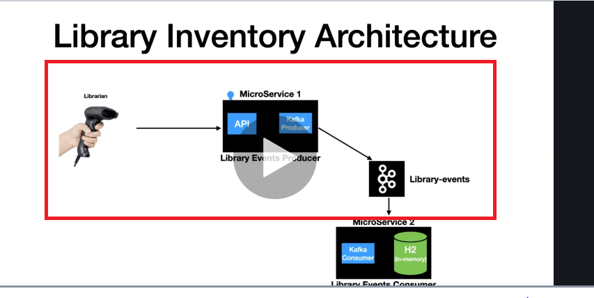

Project to develop the kafka producer using Spring boot.

The Library event it triggered if new book is issued. 

New book issued by hitting at the rest end point "/v1/libraryevent"

Library Event-:
{
"libraryEventId":2,
"libraryEventType":"NEW",
"book":{
"bookId":456,
"bookName":"Kafka Using Spring Boot",
"bookAuthor":"Dilip"
}
}

The project contains -:
1) An rest end point to post the new request ("/v1/libraryevent")
2) Producer which gets invoked on the POST call
3) Auto generation of Topic
4) Integration test